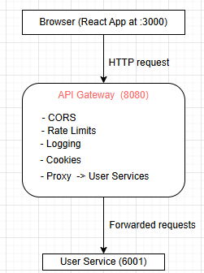

# <************ My study Note and Guideline***************>

What the overall main.ts file code does:

- This code creates a fully functioning API Gateway server using Express.
- An API (Application-User-Interface)  is a single entry point for a systme that may contain  many backend microservices

in this code, my gateway:

- accepts requests from the browser (frontend at localhost:3000)
- It applies security features: CORS, Rate limiting, cookies, loggin, body size limits
- handles a health-check endpoint 
- forwards all other requests to another backend service at localhost:6001
- Return the response from that service back to the original client
- it acts as a middle layer between the browser and the microservices

### What the system looks like



- The gateway decides WHO can send requests, HOW many requests, and WHERE to send them.

## DETAILED EXPLANATION OF SYSTEM BEHAVIOR

### 1. Frontend makes a request to the gateway
- Example:  GET ```http://localhost:8080/api/users```
- before this request reaches the backend, it goes through the following pipeline

### 2. CORS middleware checks the origin
#### here the Gateway checks:
 - Is the request coming from ```http://localhost:3000?```
 - If yes → allow it
 - If no → block with CORS error
#### This prevents unauthorized websites from using your backend.
- Allows specific headers: Authorization (for tokens), Content-Type (for JSON)
- and credentials: true allows: cookies, auth headers and TLS client certificates

### 3. Morgan logs the request
- here, we get console output like: ```GET /api/users 200 12ms```
- And, this is extremely useful for debugging all incoming traffic.

### 4. Body parsers decode the request
- If the request contains: JSON, Form data (e.g., login forms) or Cookies ...those are all decoded and attached to req.body and req.cookies.
- This ensures that: Login data, Uploads or API payloads ...are readable by our backend services.

### 5. Rate Limiter decides if client is allowed
#### the limiter checks:
-  IP made too many requests in the last 15 minutes?
- Is the user authenticated (req.user exists)?
    - If yes → allow 1000 req/15min
    - If no → allow 100 req/15min

#### This protects the server from:
- abuse
- brute force attacks
- spam
- DDoS attempts: (Distributed Denial-of-Service -> malicious cyberattacks where attackers flood a target server, website, or network with an overwhelming amount of internet traffic from multiple compromised sources) 

#### If the limit is exceeded, the gateway stops the request and returns: ```429 Too Many Requests```

### 6. Optional health check route

### If the request is: ```GET /gateway-health```, the gateway responds immediately: ```{ "message": "Welcome to api-gateway!" }```. This allows monitoring tools to confirm the gateway is alive.

### 7. Everything else is proxied to the microservice

#### This is the most important part: ```app.use("/", proxy("http://localhost:6001"));``` . This meansEVERY route, except /gateway-health, is forwarded to: ```http://localhost:6001```


#### Example:
- User calls: ```POST /login```, Gateway sends it to: ```http://localhost:6001/login```
- User calls: ```GET /api/users```, Gateway forwards to: ```http://localhost:6001/api/users```
- User calls: ```DELETE /api/profile/223```, Gateway sends to: ```http://localhost:6001/api/profile/223```

### The backend microservice does the real work and sends a response back.

### 🚀 In summary: WHAT THE WHOLE CODE IS DOING

#### This entire script builds a secure, rate-limited, proxied API gateway that:

- Accepts browser requests
- Enforces security policies (CORS, rate limits)
- Logs every request
- Parses JSON, forms, and cookies
- Provides a health-check endpoint
- Forwards all traffic to a backend service at port 6001
- Returns the backend response to the client
- You now have a full microservice gateway layer.

## FUNCTIONALITIES AND PURPOSES

### 1. import express from "express";
- this imports the Express framework. Express is the main HTTP server library that lets you create APIs, routes, middleware, etc. The default export is imported, giving you the express() function.

### 2. Imports the CORS middleware.
- CORS controls which domains can access your backend from a browser (Cross-Origin Resource Sharing). Without this, the browser blocks API calls from a different domain/port.
- CORS middleware refers to a software component, often integrated into web frameworks or servers, that facilitates Cross-Origin Resource Sharing (CORS). CORS is an HTTP-header based mechanism enabling a server to indicate which origins (domains, schemes, or ports) other than its own are allowed to load resources from it. 
- Essentially, CORS middleware helps manage and respond to cross-origin requests by adding the necessary CORS headers to server responses. These headers communicate to the browser whether a cross-origin request is permitted and under what conditions (e.g., allowed origins, HTTP methods, headers, credentials).

### 3. import proxy from "express-http-proxy";
- this Imports a package that allows your Express server to act as a reverse proxy. Used so / routes on this server forward to another server (in this case: port 6001). The proxy receives the incoming request → sends it to another server → returns the response.

### 4. import morgan from "morgan";
- Morgan is a Node.js middleware used to log HTTP requests for Express.js applications.
- Morgan logs HTTP requests to the console. Every request prints: method, path, status, response time.
- Purpose: It helps developers understand user interaction and debug their applications. 

### 5. import cookieParser from "cookie-parser";
- cookie-parser is a middleware for Express.js that parses the Cookie header from incoming HTTP requests and populates req.cookies with an object containing the parsed cookie data. This makes it easy to access and work with cookies within your Express application's routes and other middleware.
-  It automatically extracts the key-value pairs from the Cookie header of an incoming request.
- Populates req.cookies: The parsed cookie data is then made available as properties on the req.cookies object in your Express application. For example, if a cookie named username exists, you can access its value using req.cookies.username.

### 6. import { error } from "console";
- Imports the error function from Node’s console utilities.

### 7. import rateLimit, { ipKeyGenerator } from 'express-rate-limit';
- Imports the rate limiter middleware.  ipKeyGenerator is a utility that generates a proper IP string (supports IPv6 / proxies).
- A limiter or rate limiting middleware is a software component that controls the number of requests a client can make to a web application or API within a specific time frame. It acts as an intermediary, monitoring incoming requests and blocking or throttling those that exceed a predefined threshold to prevent abuse, protect against resource overload, and ensure fair usage for all users. 

### 8. const app = express();
- Creates an Express application instance. app is the main object for defining routes, middleware, settings, etc.

### 9. Trust Proxy
- app.set("trust proxy", 1);, Tells Express that this server is behind one proxy.
- Required for correct IP detection when using: Load balancers, NGINX and Cloudflare
- Without this, Express might always think the requester is 127.0.0.1.