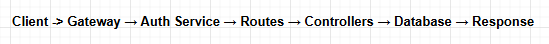

# HIGH-LEVEL EXPLANATION

This file sets up a complete authentication microservice in a microservice architecture.

In simple terms:

✔ It creates an Express server
✔ It enables CORS, JSON parsing, and cookie parsing
✔ It loads your authentication routes
✔ It automatically generates Swagger API documentation
✔ It uses a global error handler middleware
✔ It listens on port 6001 (your auth-service)

This service will be called by the API Gateway (port 8080).
The gateway forwards auth-related requests to this service.

#### Every request goes through these layers:
- CORS – validates allowed origins
- JSON body parser – converts JSON into req.body
- Cookie parser – extracts cookies
- Routes (auth.router) – matches the correct auth endpoint
- Error Middleware – handles all thrown errors centrally
- Swagger Docs – generates documentation UI
- Response sent to client
- This architecture is professional, scalable, production-ready.